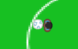
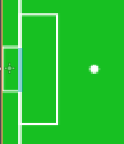
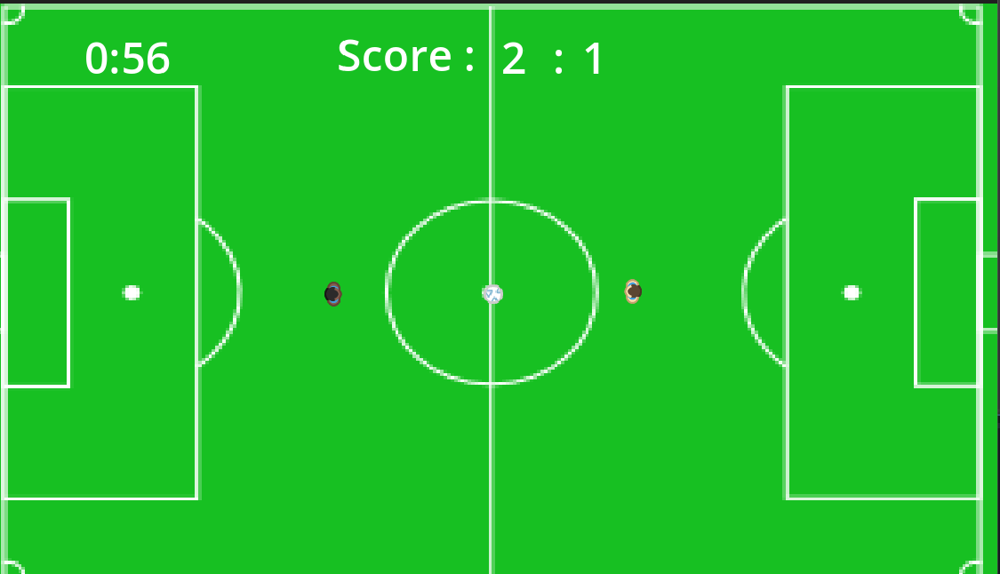

# Soccer 2023 

> Un jeu de Saliou Ndong

Ayant toujours eu un intérêt particulier pour le soccer, j'ai décidé de faire ce jeu et d'y présenter quelques concepts dans ce domaine. Le but est de contrôler le ballon et de faire des buts. Il y'a un adversaire qui essaie lui aussi de faire des buts. Une partie dure `02 minutes` et le premier qui réussit à faire `3 buts` gagne la partie.

## Contrôle du ballon
Dans le concept du soccer, le ballon doit être libre et donc tous les joueurs peuvent y avoir accès. Je pensais trop compliqué au début en rattachant le ballon au joueur. C'est ainsi que mon professeur `Nicolas Bourre` m'a fait comprendre comment je pourrais m'y prendre.

## Détection de but
J'ai utilisé un Area2D avec un CollisionShape2D que j'ai mis au niveau des buts. Sachant que le balon est un RigidBody2D mais j'y est inclus aussi un Area2D avec un CollisionShape2D. Et donc, je vérifie si mes deux Area2D rentrent en collision. Si Oui, il y'a but

## Sauvegarde de données

C'est la partie qui m'a le plus marquée avec l'utilisation du `Singleton` qui est un outil utile pour résoudre le cas d'utilisation commun où l'on doit stocker des informations persistantes entre les scènes: [Godot Singleton Autoload](https://docs.godotengine.org/en/stable/tutorials/scripting/singletons_autoload.html)

Après chaque but, je rejoue la scène courante. Mais grâce au `Singleton` qui est accessible de toutes les scènes, les données ne se réinitialisent pas et je suis capable de sauvegarder le timer et le score. 